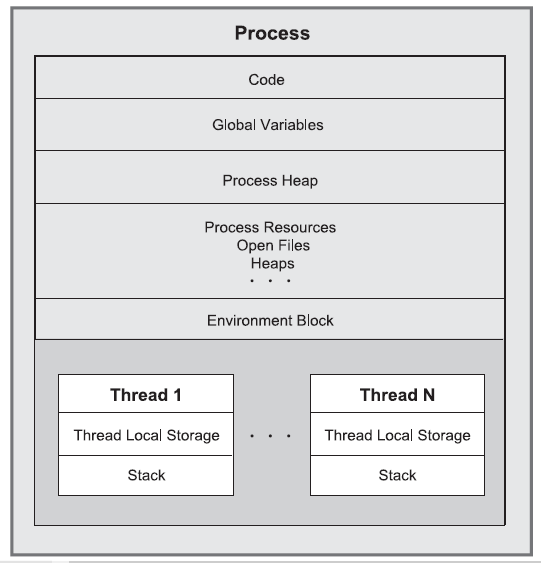

 
## Appunti vari
Soluzione :

vedere [qui](http://sysprogs.com/GDBServerFoundation/dox/_simple_win32_server_2_simple_win32_server_8cpp-example.html) cosa fa questo server facendolo partire.
A quel punto si potrebbe rivedere la stessa cosa ma in seno ai softerror, ovvero cambiare cosa fanno le api e magari fornire un interfaccia per interagire con il server.

    #include "stdafx.h"
Serve scaricare questa libreria

Deprecato:
~~fare tutto in unix, usare la libreria [GDB/MI](https://sourceware.org/gdb/onlinedocs/gdb/GDB_002fMI.html) per interagire con il codice del programma, stopparlo scegliendo le funzioni e quant'altro.
Da GDB o da C++ riusciamo a prendere i puntatori agli indirizzi di memoria virtuale che il processo usa, tipo lo stack pointer dei thread oppure l'heap ecc.
Avendo gli indirizzi a quel punto utilizzare [asm](https://gcc.gnu.org/onlinedocs/gcc/Extended-Asm.html#Extended-Asm) per modificare il valore dei registri ecc.
Per attuare questa soluzione però bisogna capire come usare assembly, cosa farci di preciso ecc.
(Aspettando in tutto ciò se su stack overflow qualcuno mi suggerisce una libreria o debugger da utilizzare su windows, a quel punto si può gestire il lato modifiche HW da codice utilizzando, almeno in parte le windows api tipo debugapi.h e memory.h per il thread context, heap ecc.)~~

Deprecato:
~~1) un modo per settare i breakpoint sul programma prima di creare ed eseguire il processo (forse appoggiandosi a LLDB debugger che ha una libreria che espone un interfaccia compatibile con C++) **probabilmente devo attaccarmi al debug di gdb con delle api (https://sourceware.org/gdb/papers/libgdb2/libgdb_1.html#SEC1)**
2) capire cosa si può modificare in questo modo
3) settare un thread context e vedere che succede 
4) interpretare il thread context
5) guardate sotto nota **!!**
6) **trovare funzione migliore di CreateProcess() per attaccarsi al processo e magari vederlo meglio**~~

nota :
per settare i breakpoint o si usa LLDB (da vedere), oppure lo facciamo eseguendolo su un gdb che ci setta i breakpoint (lo fai all'inizio dell esecuzione), quando arriva ad un breakpoint il controllo passa all'applicazione che permette di gestire e cambiare il contenuto del context thread e anche dell'heap, visto che il context punta allo stack si può pensare di (forse ?) eseguire uno script in assembly che fa qualche cosa in particolare.
Oppure bisognerebbe capire se DebugBreak() funziona per quello che ci serve oppure no

Guardare anche qui per [SetBreakpoint](https://docs.microsoft.com/en-us/windows-hardware/drivers/ddi/dbgeng/nf-dbgeng-idebugcontrol3-addbreakpoint)

**!!**
Inoltre le funzioni che mette a disposizione windows per il debugger sono [qui](https://docs.microsoft.com/en-us/windows-hardware/drivers/ddi/_debugger/) da li ci sono funzioni per fare quasi tutto in termini di manipolazione dei processi e dei dati annessi a quei processi
## 16/09/2020

tento di eseguire il programma tramite il debugger, l'idea è quella di avviare con il debugger (GDB) il processo e settare i brakpoint da gdb, a quel punto aspettarli dal programma e quando si raggiunge si eseguono le le funzioni di Set/GetThreadContext per i context del/dei thread/s.

Se si potesse scrivere sullo stdin di un altro processo da me creato sarebbe good.

Bisogna avviare i processi in 3 shell separate altrimenti GDB non vede il processo (anzi non si vede nemmeno dal taskmanager), con flag PROCESS_DEBUG il processo non viene creato e GDB infatti non lo vede

usare FLAG -O0 -ggdb

## 15/09/2020

Vedere sopra in soluzione:

nota:
Il thread su cui eseguo le operazioni ora è quello che fa partire CreateProcess, quindi il thread dovrebbe essere quello, in sostanza dovrei rifarmi al processo.
In ogni caso essendo su windows ogni processo crea almeno un thread per eseguire il main, quindi dovrei riuscire ad attaccarmi a quel thread in caso.

## 14/09/2020

1 : prima di fare getThreadContext() bisogna sospendere il thread con SuspendThread()
2 : la struttura context che prende getThreadContext dipende dall'architettura del pc, non è detto che
ci sia nel caso AMD per questo forse da errore (code error: 998)
3 : la variante Wow64 delle funzioni ritorna lo stesso erroe 998

il context va allineato secondo il tipo di architettura e vanno settate le flag giuste prima di chiamare 
getThreadContext

private enum CONTEXT64_FLAGS : uint
{
    CONTEXT64_AMD64 = 0x100000,
    CONTEXT64_CONTROL = CONTEXT64_AMD64 | 0x01,
    CONTEXT64_INTEGER = CONTEXT64_AMD64 | 0x02,
    CONTEXT64_SEGMENTS = CONTEXT64_AMD64 | 0x04,
    CONTEXT64_FLOATING_POINT = CONTEXT64_AMD64 | 0x08,
    CONTEXT64_DEBUG_REGISTERS = CONTEXT64_AMD64 | 0x10,
    CONTEXT64_FULL = CONTEXT64_CONTROL | CONTEXT64_INTEGER | CONTEXT64_FLOATING_POINT,
    CONTEXT64_ALL = CONTEXT64_CONTROL | CONTEXT64_INTEGER | CONTEXT64_SEGMENTS | CONTEXT64_FLOATING_POINT | CONTEXT64_DEBUG_REGISTERS
}

errore risolto in questo modo :

CONTEXT ctx;
	ctx.ContextFlags = CONTEXT_ALL;
	//PWOW64_CONTEXT ctx = {};
	if (GetThreadContext(thread,&ctx) == 0) {
		cout << "[Main] Not able to take thread context..exit :" << GetLastError() << endl;
		return 1;
	}

invece di passare LPCOntext passo &ctx e setto le flag, forse c'è da impostare un offeset dei registri 

se ne parla qui : http://www.rohitab.com/discuss/topic/43738-getthreadcontext-is-failing/

Windows 10
Rcx = 5963776
Rdx = 6492160
Works fine

probabilmente dipende dal singolo sistema, guardare su WinNT.h source code (https://source.winehq.org/source/include/winnt.h)

In ogni caso la struttura context => https://docs.microsoft.com/en-us/windows/win32/api/winnt/ns-winnt-context

    typedef struct _CONTEXT {
      DWORD64 P1Home;
      DWORD64 P2Home;
      DWORD64 P3Home;
      DWORD64 P4Home;
      DWORD64 P5Home;
      DWORD64 P6Home;
      DWORD   ContextFlags;
      DWORD   MxCsr;
      WORD    SegCs;
      WORD    SegDs;
      WORD    SegEs;
      WORD    SegFs;
      WORD    SegGs;
      WORD    SegSs;
      DWORD   EFlags;
      DWORD64 Dr0;
      DWORD64 Dr1;
      DWORD64 Dr2;
      DWORD64 Dr3;
      DWORD64 Dr6;
      DWORD64 Dr7;
      DWORD64 Rax;
      DWORD64 Rcx;
      DWORD64 Rdx;
      DWORD64 Rbx;
      DWORD64 Rsp;
      DWORD64 Rbp;
      DWORD64 Rsi;
      DWORD64 Rdi;
      DWORD64 R8;
      DWORD64 R9;
      DWORD64 R10;
      DWORD64 R11;
      DWORD64 R12;
      DWORD64 R13;
      DWORD64 R14;
      DWORD64 R15;
      DWORD64 Rip;
      union {
        XMM_SAVE_AREA32 FltSave;
        NEON128         Q[16];
        ULONGLONG       D[32];
        struct {
          M128A Header[2];
          M128A Legacy[8];
          M128A Xmm0;
          M128A Xmm1;
          M128A Xmm2;
          M128A Xmm3;
          M128A Xmm4;
          M128A Xmm5;
          M128A Xmm6;
          M128A Xmm7;
          M128A Xmm8;
          M128A Xmm9;
          M128A Xmm10;
          M128A Xmm11;
          M128A Xmm12;
          M128A Xmm13;
          M128A Xmm14;
          M128A Xmm15;
        } DUMMYSTRUCTNAME;
        DWORD           S[32];
      } DUMMYUNIONNAME;
      M128A   VectorRegister[26];
      DWORD64 VectorControl;
      DWORD64 DebugControl;
      DWORD64 LastBranchToRip;
      DWORD64 LastBranchFromRip;
      DWORD64 LastExceptionToRip;
      DWORD64 LastExceptionFromRip;
    } CONTEXT, *PCONTEXT;

#4

Ogni processo viene generato con un singolo thread, il thread in windows è l'unità base di 
sincronizzazione.
(Nota: windows non mantiene vincoli di parentela tra i processi che crea, quindi non è del tutto appropriato parlare di processo padre e figlio)

(Informazioni sul thread/process [model di windows](https://docs.microsoft.com/en-us/windows-hardware/drivers/kernel/windows-kernel-mode-process-and-thread-manager#:~:text=A%20process%20is%20a%20software,a%20number%20that%20identifies%20it.))

Ogni thread crea una struttura dati *TLS (Thread Local Storage)* nella memoria virtuale associata al processo e mette le variabile che appartengono a lui.

